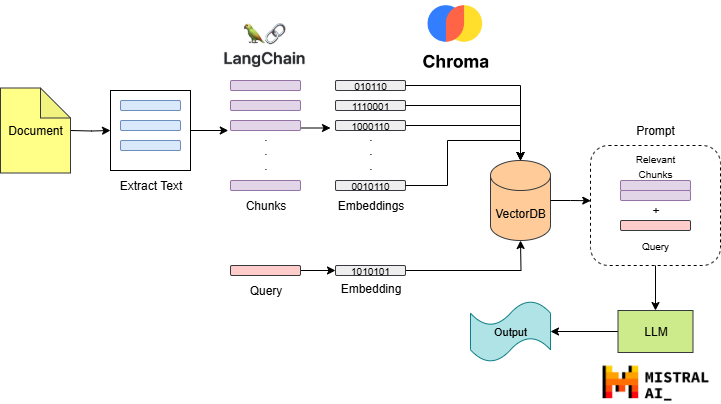
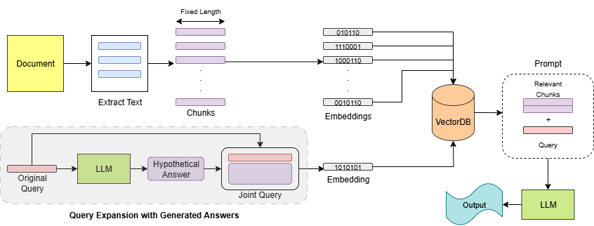
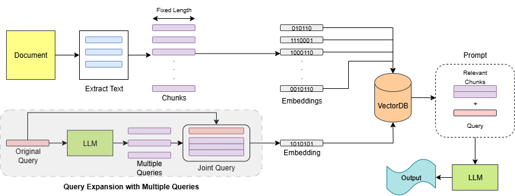
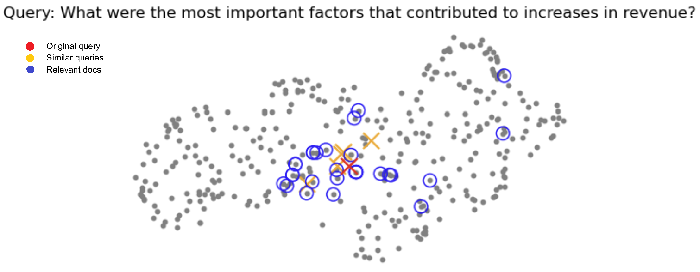
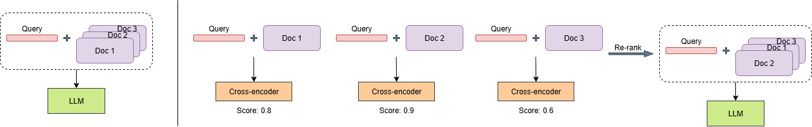

# RAG Chroma Mistral
Retrieval for AI with Chroma and Mistral.

### Tools:
- LangChain  ➡️ Chunking
- Chroma  ➡️ Embedding, Vector DB, Retrieval
- Mistral AI  ➡️ LLM

### Query Expansion:
1. Query Expansion with Generated Answers

2. Query Expansion with Multiple Queries

### Visualization:

### Cross-encoder Re-ranking:

